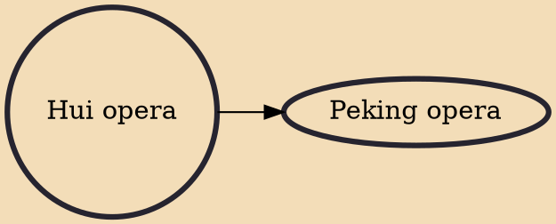

Hui opera, or Huiju (Chinese: 徽剧), is a regional genre of Chinese opera originally from southern Anhui. It is popular in the area around Huangshan City and Chizhou, as well as Wuyuan County, Jiangxi, and was formerly also popular in neighboring Zhejiang. It has existed for over 300 years. It is named for the historical region of Huizhou (now the city of Huangshan, Anhui), where it originated. Huiju was introduced to Beijing during the Qianlong Emperor's eightieth birthday celebrations, and was influential in being a precursor of Beijing opera.

## Derivatives
- [[Peking opera]]
