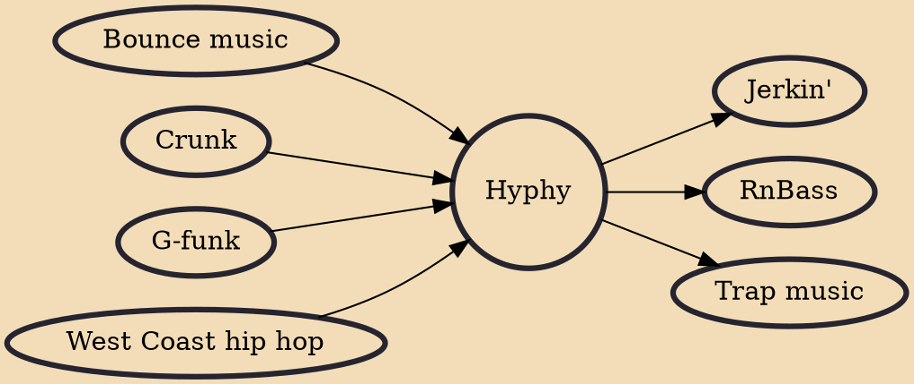

The term hyphy (/ˈhaɪfiː/ HY-fee) is Oakland slang meaning "hyperactive". More specifically, it is an adjective describing the hip hop music and the culture associated with the area. The term was first coined by Oakland rapper Keak da Sneak.

## Influences
- [[Bounce music]]
- [[Crunk]]
- [[G-funk]]
- [[West Coast hip hop]]

## Derivatives
- [[Jerkin']]
- [[RnBass]]
- [[Trap music]]
