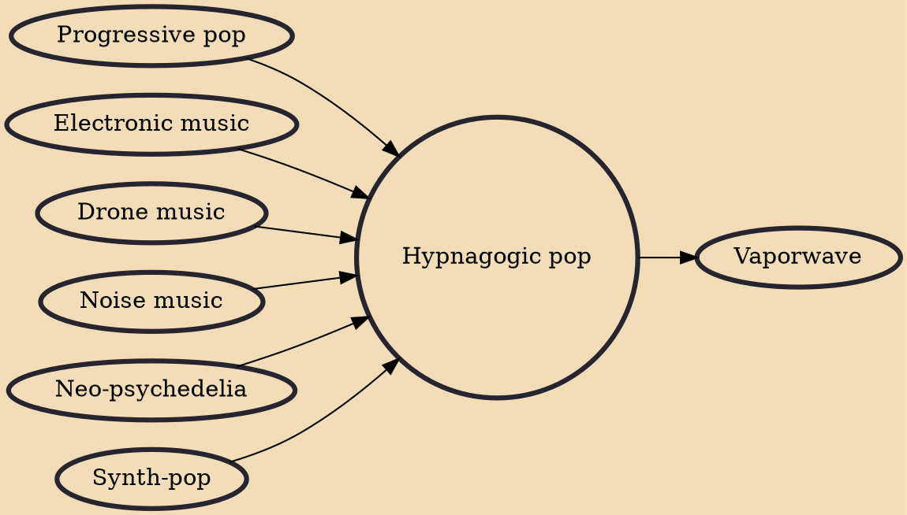

Hypnagogic pop (often abbreviated as h-pop) is pop or psychedelic music that evokes cultural memory and nostalgia for the popular entertainment of the past (principally the 1980s). It emerged in the mid to late 2000s as American lo-fi and noise musicians began adopting retro aesthetics remembered from their childhood, such as radio rock, new wave pop, light rock, video game music, synth-pop, and R&B. Recordings circulated on cassette or Internet blogs and were typically marked by the use of outmoded analog equipment and DIY experimentation.

## Influences

- [[Progressive pop]]
- [[Electronic music]]
- [[Drone music]]
- [[Noise music]]
- [[Neo-psychedelia]]
- [[Synth-pop]]

## Derivatives

- [[Vaporwave]]
