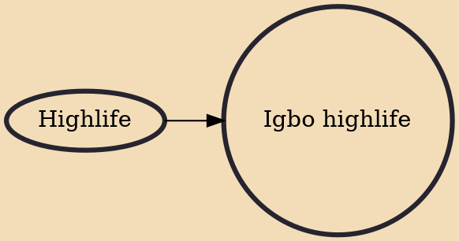

Igbo highlife is a contemporary musical genre which combines highlife and Igbo traditional music. It first started off in the southeast region of Nigeria, during the 1920s in Lagos. The genre is primarily guitar-based music, with rare characteristic blend of horns and vocal rhythms. Igbo highlife lyrics are sung mostly in Igbo with occasional infusion of Pidgin English. One of the most influential composers and performers of the music is Chief Stephen Osita Osadebe whose career spanned over 40 years. Osadebe's discography comprises numerous popular songs including the 1984 hit "Osondi Owendi" which launched him on the world stage as a pioneer of the Igbo highlife genre.

## Influences
- [[Highlife]]
