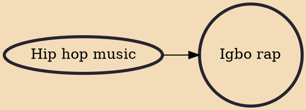

Igbo rap is a Nigerian style of hip hop music that originated in the Igbo-dominated southeastern region of Nigeria and has become more popular since 2000. The style draws its main influences from Igbo traditional music and African American music. Aside other derived styles, it can be combined with highlife, R&B and afro-soul. Most artists and groups who perform Igbo rap usually deliver their lyrics in the Igbo language, although on some occasions, Igbo is blended with Pidgin English.

## Influences

- [[Hip hop music]]
