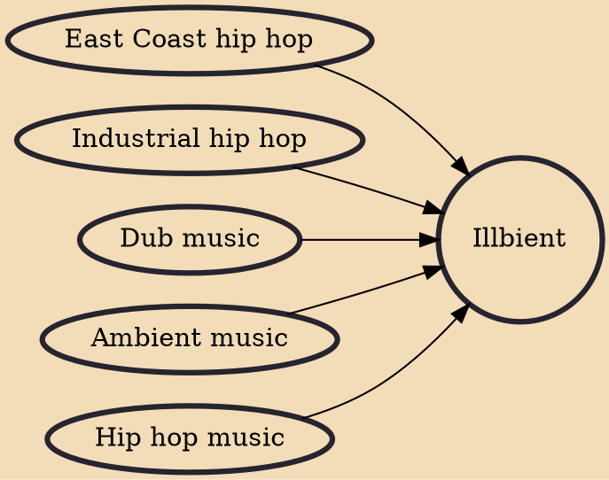

Illbient is a genre of electronic music and an art movement that originated among hip hop-influenced artists from Williamsburg, New York City around 1994. DJ Olive, and DJ Spooky, pioneers of the genre, have both claimed to have coined the term. The word "illbient" combines the hip hop slang term "ill" (a positive expression: bad meaning good) and "ambient".

## Influences
- [[East Coast hip hop]]
- [[Industrial hip hop]]
- [[Dub music]]
- [[Ambient music]]
- [[Hip hop music]]
