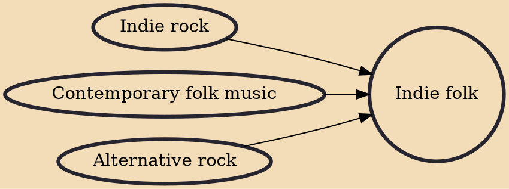

Indie folk is a music genre that arose in the 1990s among musicians from indie rock scenes influenced by folk music. Indie folk hybridizes the acoustic guitar melodies of traditional folk music with contemporary instrumentation. In the United Kingdom, artists such as Ben Howard and Mumford & Sons emerged, with the latter band promoting the music style through their Gentlemen of the Road touring festivals. The success of acts like Mumford & Sons led some music journalists like Popjustice's Peter Robinson labelling this new British music scene as The New Boring or Beige Pop.

## Influences
- [[Indie rock]]
- [[Contemporary folk music]]
- [[Alternative rock]]
