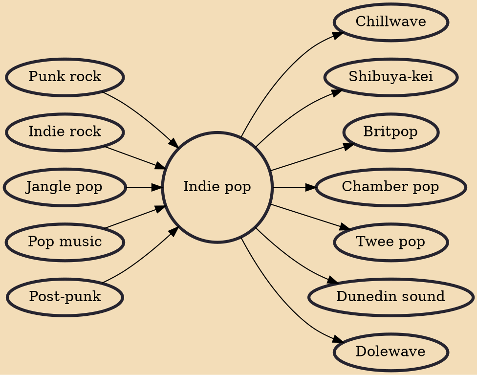

Indie pop (also typeset as indie-pop or indiepop) is a music genre and subculture that combines guitar pop with DIY ethic in opposition to the style and tone of mainstream pop music. It originated from British post-punk in the late 1970s and subsequently generated a thriving fanzine, label, and club and gig circuit. Compared to its counterpart, indie rock, the genre is more melodic, less abrasive, and relatively angst-free. In later years, the definition of indie pop has bifurcated to also mean bands from unrelated DIY scenes/movements with pop leanings. Subgenres include chamber pop and twee pop.

## Influences

- [[Punk rock]]
- [[Indie rock]]
- [[Jangle pop]]
- [[Pop music]]
- [[Post-punk]]

## Derivatives

- [[Chillwave]]
- [[Shibuya-kei]]
- [[Britpop]]
- [[Chamber pop]]
- [[Twee pop]]
- [[Dunedin sound]]
- [[Dolewave]]
