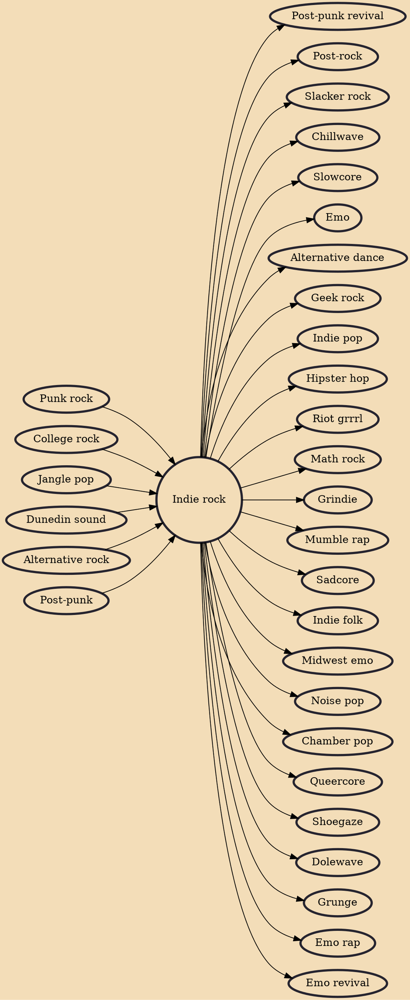

Indie rock is a subgenre of rock music that originated in the United States, United Kingdom and New Zealand from the 1970s to the 1980s. Originally used to describe independent record labels, the term became associated with the music they produced and was initially used interchangeably with alternative rock or "guitar pop rock".

## Influences

- [[Punk rock]]
- [[College rock]]
- [[Jangle pop]]
- [[Dunedin sound]]
- [[Alternative rock]]
- [[Post-punk]]

## Derivatives

- [[Post-punk revival]]
- [[Post-rock]]
- [[Slacker rock]]
- [[Chillwave]]
- [[Slowcore]]
- [[Emo]]
- [[Alternative dance]]
- [[Geek rock]]
- [[Indie pop]]
- [[Hipster hop]]
- [[Riot grrrl]]
- [[Math rock]]
- [[Grindie]]
- [[Mumble rap]]
- [[Sadcore]]
- [[Indie folk]]
- [[Midwest emo]]
- [[Noise pop]]
- [[Chamber pop]]
- [[Queercore]]
- [[Shoegaze]]
- [[Dolewave]]
- [[Grunge]]
- [[Emo rap]]
- [[Emo revival]]
