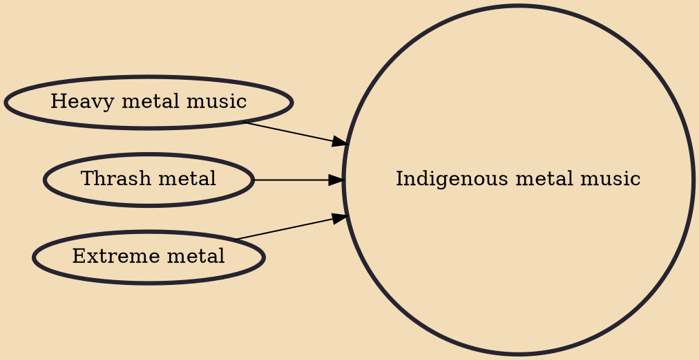

Indigenous metal is heavy metal music played by indigenous peoples of various colonized regions. Bands may play music from across the metal spectrum, though most center indigenous themes, stories, or instruments. Groups with indigenous members are sometimes considered to play indigenous metal regardless of the thematic content of their music. "True" native metal (heavy metal created by Native American artists who utilize traditional instruments and language) gained popularity throughout the 2000s, especially in parts of Arizona, New Mexico, and Texas.

## Influences

- [[Heavy metal music]]
- [[Thrash metal]]
- [[Extreme metal]]
