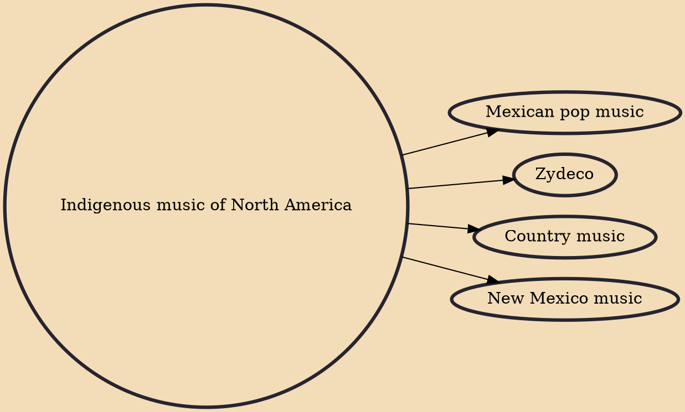

Indigenous music of North America, which includes American Indian music or Native American music, is the music that is used, created or performed by Indigenous peoples of North America, including Native Americans in the United States and Aboriginal peoples in Canada, Indigenous peoples of Mexico, and other North American countries—especially traditional tribal music, such as Pueblo music and Inuit music. In addition to the traditional music of the Native American groups, there now exist pan-Indianism and intertribal genres as well as distinct Native American subgenres of popular music including: rock, blues, hip hop, classical, film music, and reggae, as well as unique popular styles like chicken scratch and New Mexico music.

## Derivatives
- [[Mexican pop music]]
- [[Zydeco]]
- [[Country music]]
- [[New Mexico music]]
