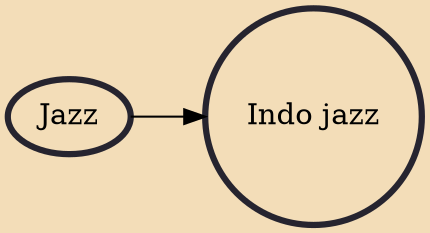

Indo jazz is a musical genre consisting of jazz, classical and Indian influences. Its structure and patterns are based on Indian music with typical jazz improvisation overlaid. While the term itself may be comparatively recent, the concept dates at least to the mid-1950s. Musicians including John Coltrane, Yusef Lateef and others reflect Indian influences.

## Influences

- [[Jazz]]
