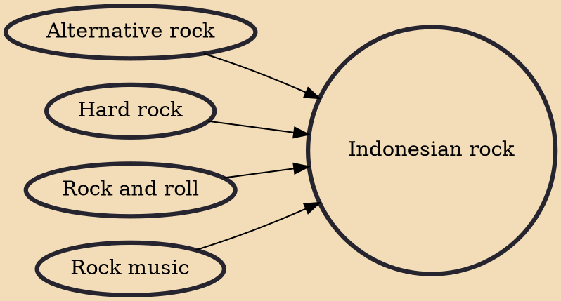

Indonesian rock is rock music from Indonesia, a product of the culture and globalizing outlook of the country, similar to this genre's music globally. Indonesian-specific ideas about individualism, interdependency, modernism, and the supernatural have also been observed in the rock videos and music of the nation. One of the largest rock festivals in Indonesia is the Jakarta Rock Parade, a 3-day festival recently hosting over 100 bands.

## Influences

- [[Alternative rock]]
- [[Hard rock]]
- [[Rock and roll]]
- [[Rock music]]
