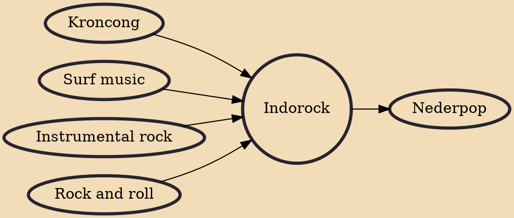

Indorock is a musical genre that originated in the 1950s in the Netherlands. It is a fusion of Indonesian and Western music, with roots in Kroncong (traditional Portuguese-Indonesian fusion music). The genre was invented by Indo repatriates in the Netherlands after Indonesian independence on August 17, 1945, and became popular especially in Germany. Indorock is one of the earliest forms of "Eurorock". Its influence on Dutch popular music was immense.

## Influences
- [[Kroncong]]
- [[Surf music]]
- [[Instrumental rock]]
- [[Rock and roll]]

## Derivatives
- [[Nederpop]]
