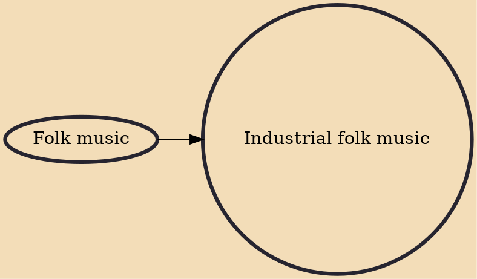

Industrial folk music, industrial folk song, industrial work song or working song is a subgenre of folk or traditional music that developed from the 18th century, particularly in Britain and North America, with songs dealing with the lives and experiences of industrial workers. The origins of industrial folk song are in the British industrial revolution of the eighteenth century as workers tended to take the forms of music with which they were familiar, including ballads and agricultural work songs, and adapt them to their new experiences and circumstances. They also developed in France and the US as these countries began to industrialise.

## Influences
- [[Folk music]]
