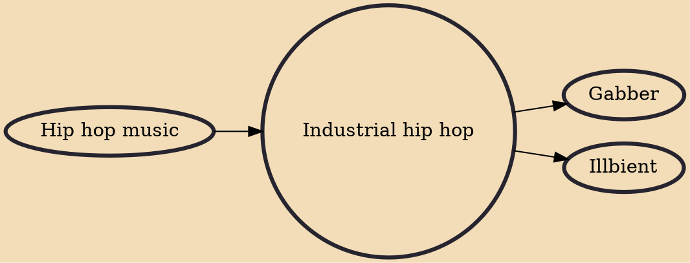

```dot
digraph {
	graph [bgcolor="#F3DDB8" rankdir=LR]
	node [color="#26242F" penwidth=3.0]
	"Industrial hip hop" [shape=circle]
	"Hip hop music" [URL="/hip-hop-music/"]
	"Hip hop music" -> "Industrial hip hop"
	Gabber [URL="/gabber/"]
	"Industrial hip hop" -> Gabber
	Illbient [URL="/illbient/"]
	"Industrial hip hop" -> Illbient
}
```

Industrial hip hop is a fusion genre of industrial music and hip hop.

## Influences
- [[Hip hop music]]

## Derivatives
- [[Gabber]]
- [[Illbient]]
