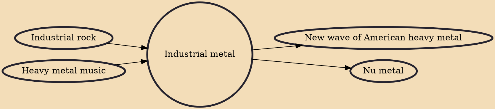

Industrial metal is the fusion of heavy metal and industrial music, typically employing repeating metal guitar riffs, sampling, synthesizer or sequencer lines, and distorted vocals. Prominent industrial metal acts include Ministry, Nine Inch Nails, Marilyn Manson, Rammstein, Godflesh, and Fear Factory.

## Influences
- [[Industrial rock]]
- [[Heavy metal music]]

## Derivatives
- [[New wave of American heavy metal]]
- [[Nu metal]]
