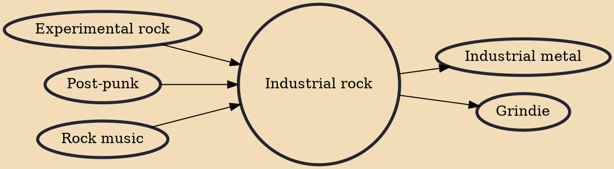

Industrial rock is a fusion genre that fuses industrial music and rock music. It initially originated in the 1970s, and drew influence from early experimental and industrial acts such as Cromagnon, Throbbing Gristle, Einstürzende Neubauten and Chrome. Industrial rock became more prominent in the 1980s with the success of artists such as Killing Joke, Swans, and partially Skinny Puppy, and later spawned the offshoot genre known as industrial metal. The genre was made more accessible to mainstream audiences in the 1990s with the aid of acts such as Nine Inch Nails and Marilyn Manson, both of which have released platinum-selling records.

## Influences
- [[Experimental rock]]
- [[Post-punk]]
- [[Rock music]]

## Derivatives
- [[Industrial metal]]
- [[Grindie]]
