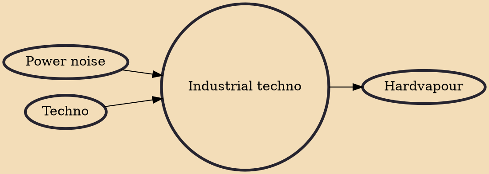

Industrial techno is a subgenre of techno and industrial dance music that originated in the 1990s. Characteristically, it incorporates influences from the bleak, noisy sound and aesthetics of early industrial music acts, particularly Cabaret Voltaire and Throbbing Gristle. American industrial music label Wax Trax! also had a profound influence over the genre's development. The genre has seen a resurgence in the 2010s, spearheaded by acts such as Adam X, Orphx, and Ancient Methods, and others later like Blawan and Karenn. As a result, it has gained a significant fanbase from the post-dubstep audience. It is not to be mistaken with Techno Industrial, which is in essence similar to the power noise/rhythmic noise subgenre. The different terminology is used depending if one is coming from a tec

## Influences
- [[Power noise]]
- [[Techno]]

## Derivatives
- [[Hardvapour]]
