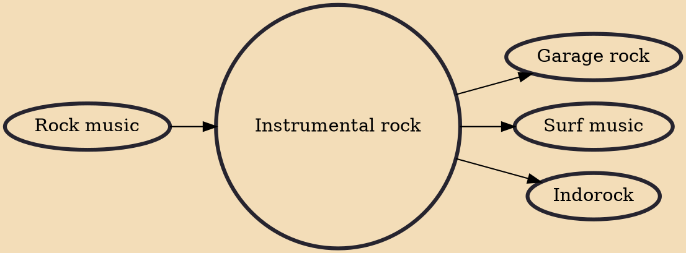

Instrumental rock is rock music that emphasizes musical instruments and features very little or no singing. Examples of instrumental rock can be found in practically every subgenre of rock, often from musicians who specialize in the style. Instrumental rock was most popular from the mid-1950s to mid-1960s, with artists such as Bill Doggett Combo, The Fireballs, The Shadows, The Ventures, Johnny and the Hurricanes and The Spotnicks. Surf music had many instrumental songs. Many instrumental hits had roots from the R&B genre. The Allman Brothers Band feature several instrumentals. Jeff Beck also recorded two instrumental albums in the 1970s. Progressive rock and art rock performers of the 1960s and 1970s did many virtuosic instrumental performances.

## Influences

- [[Rock music]]

## Derivatives

- [[Garage rock]]
- [[Surf music]]
- [[Indorock]]
