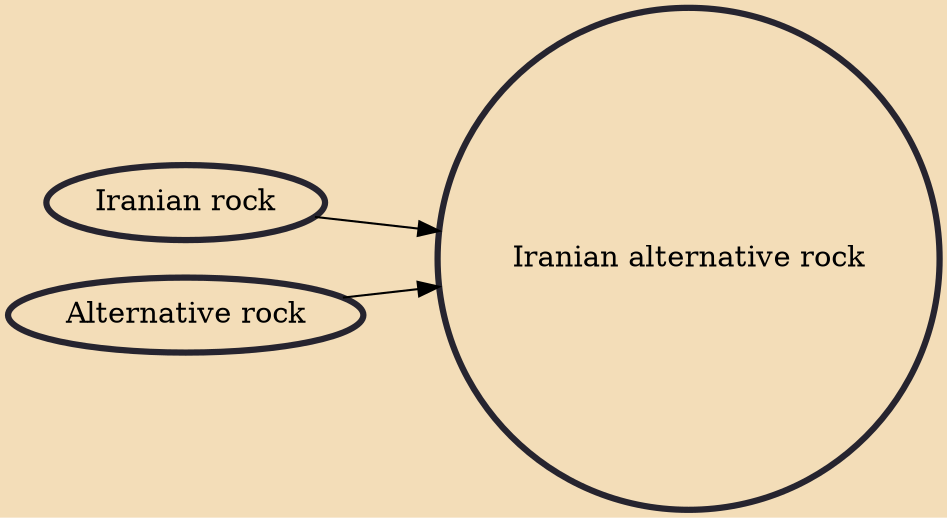

Iranian alternative rock is a subgenre of Iranian rock. This style was inspired by the alternative rock works of American musicians. This style was formed at the end of Iran-Iraq war in Tehran to defuse the pressure of war.

## Influences
- [[Iranian rock]]
- [[Alternative rock]]
