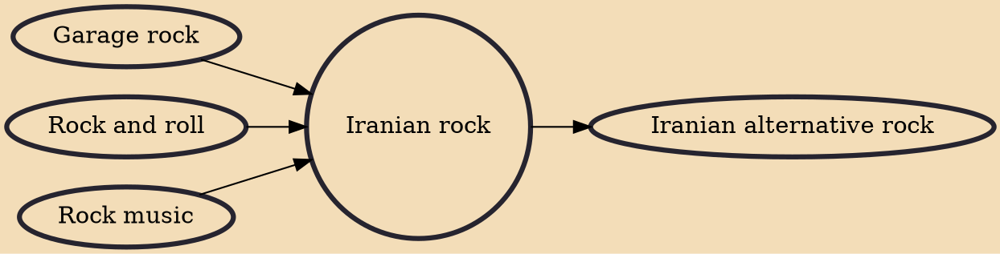

Iranian rock (also known as Rocka red) refers to rock music produced by Iranian artists. Rock music has been popular in Iran since the late forties, with the emergence of singers such as Kourosh Yaghmaei, Farhad Mehrad, Fereydoon Foroughi and Habib Mohebian, but was largely forgotten after the Iranian Revolution. Like most rock styles, electric guitar and bass guitar and drums are the main instruments in this type of music. In some groups, the keyboard also has the task of adjusting the rhythms and symbols.

## Influences
- [[Garage rock]]
- [[Rock and roll]]
- [[Rock music]]

## Derivatives
- [[Iranian alternative rock]]
