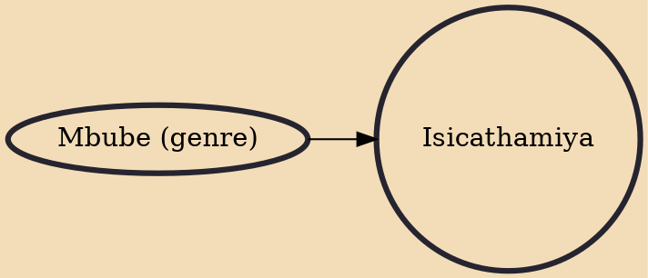

Isicathamiya (with the "c" pronounced as a dental click) is a singing style that originated from the South African Zulus. In European understanding, a cappella is also used to describe this form of singing. South African singing groups such as Ladysmith Black Mambazo demonstrate this style. Isicathamiya choirs are traditionally all male. Its roots reach back before the turn of the 20th century, when numerous men left the homelands in order to search for work in the cities. As many of the tribesmen became urbanized, the style was forgotten through much of the 20th century.

## Influences

- [[Mbube (genre)]]
