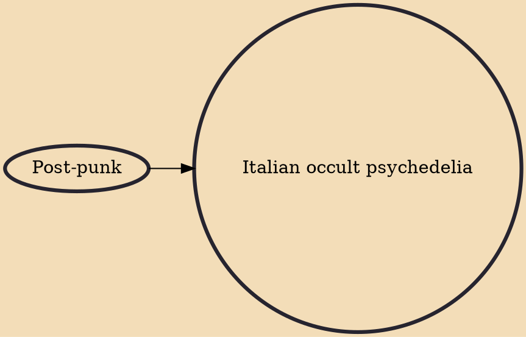

Italian occult psychedelia (IOP) is a subgenre of Italian psychedelic music characterized by obscure atmospheres. Italian occult psychedelia was coined by journalist in an article published by Italian music magazine Blow Up, in January 2012.A festival called Thalassa has occurred in Rome since 2013 to celebrate Italian occult psychedelia bands.

## Influences

- [[Post-punk]]
