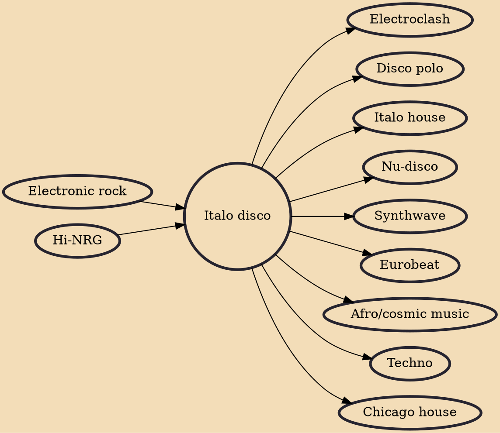

Italo disco (variously capitalized, and sometimes hyphenated as Italo-disco) is a music genre which originated in Italy in the late 1970s and was mainly produced in the early 1980s. Italo disco evolved from the then-current underground dance, pop, and electronic music, both domestic and foreign (American hi-NRG, French Euro disco) and developed into a diverse genre. The genre employs electronic drums, drum machines, synthesizers, and occasionally vocoders. It is usually sung in English, and to a lesser extent in Italian and Spanish.

## Influences
- [[Electronic rock]]
- [[Hi-NRG]]

## Derivatives
- [[Electroclash]]
- [[Disco polo]]
- [[Italo house]]
- [[Nu-disco]]
- [[Synthwave]]
- [[Eurobeat]]
- [[Afro/cosmic music]]
- [[Techno]]
- [[Chicago house]]
