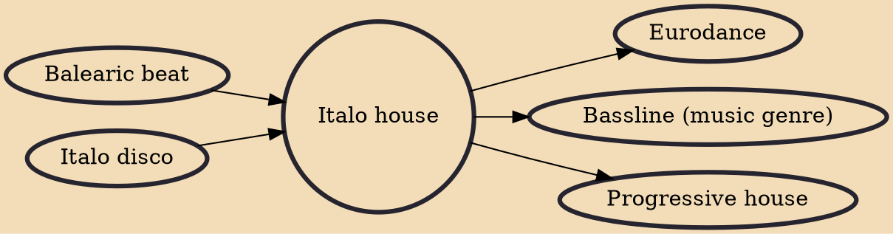

Italo house (often simply referred to as "Italian" or "Italian house" in the UK) is a form of house music originating in Italy. Typically popular in Italy, Britain, and United States since the late 1980s, it fuses house music and Italo disco. The genre's main musical characteristic is its use of predominantly electronic piano chords in a more lyrical form than classic Chicago house records. The best known example is Black Box's "Ride on Time", but the genre became very popular in the late 1980s and early 1990s for the uplifting and anthemic tunes against the background of indie-dance.

## Influences

- [[Balearic beat]]
- [[Italo disco]]

## Derivatives

- [[Eurodance]]
- [[Bassline (music genre)]]
- [[Progressive house]]
