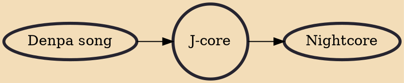

J-core is the style of hardcore techno associated with Japanese groups and DJs from the late 1990s onward. It is marked by its usage of samples derived from video games and anime, colorful kawaii imagery and album graphics, and the general borrowing of elements from denpa and otaku culture. The style is featured in video games such as Beatmania IIDX and forms a substantial part of the doujin music scene.

## Influences

- [[Denpa song]]

## Derivatives

- [[Nightcore]]
