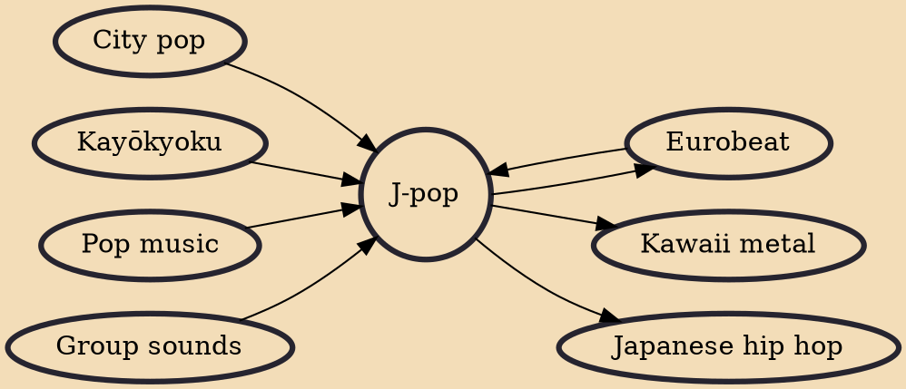

J-pop (Japanese: ジェイポップ, jeipoppu; often stylized as J-POP; an abbreviated form of "Japanese popular music"), natively also known simply as pops (ポップス, poppusu), is the name for a form of popular music that entered the musical mainstream of Japan in the 1990s. Modern J-pop has its roots in traditional music of Japan, and significantly in 1960s pop and rock music. J-pop replaced kayōkyoku ("Lyric Singing Music", a term for Japanese popular music from the 1920s to the 1980s) in the Japanese music scene.

## Influences
- [[City pop]]
- [[Eurobeat]]
- [[Kayōkyoku]]
- [[Pop music]]
- [[Group sounds]]

## Derivatives
- [[Eurobeat]]
- [[Kawaii metal]]
- [[Japanese hip hop]]
