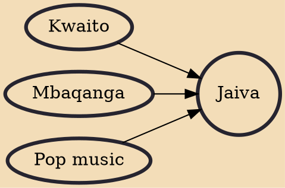

Jaiva, Township jive (TJ), Soweto jive, Soweto sound or Soweto beat is a subgenre of South African township music and African dance form that influenced Western breakdance and emerged from the shebeen culture of the apartheid-era townships.

## Influences

- [[Kwaito]]
- [[Mbaqanga]]
- [[Pop music]]
