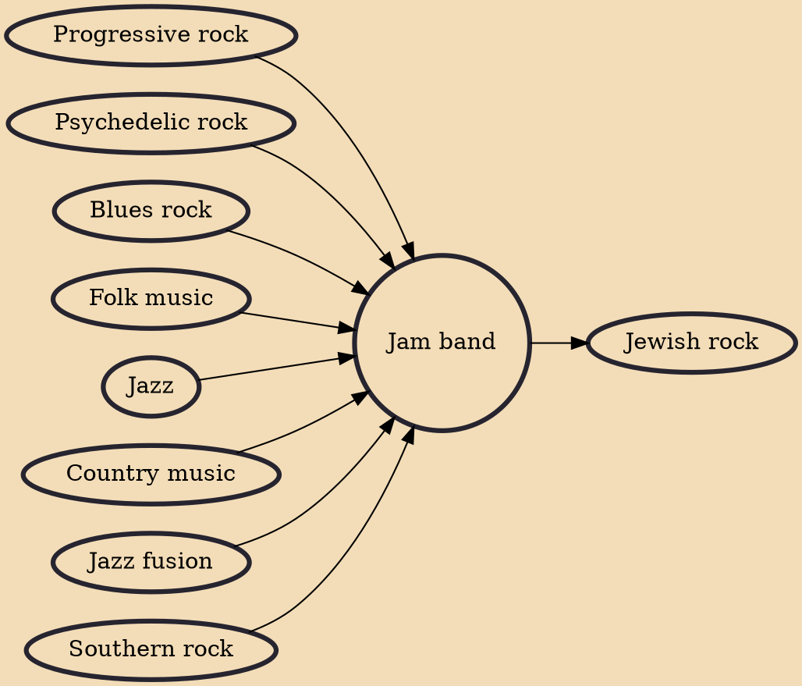

A jam band is a musical group whose concerts (and live albums) are characterized by lengthy improvisational "jams." These include extended musical improvisation over rhythmic grooves and chord patterns, and long sets of music which often cross genre boundaries. Most jam band sets will consist of variations on songs that have already been released as studio recordings. Jam bands are known for having a very fluid structure, often having one song lead into another without any interruption.

## Influences
- [[Progressive rock]]
- [[Psychedelic rock]]
- [[Blues rock]]
- [[Folk music]]
- [[Jazz]]
- [[Country music]]
- [[Jazz fusion]]
- [[Southern rock]]

## Derivatives
- [[Jewish rock]]
