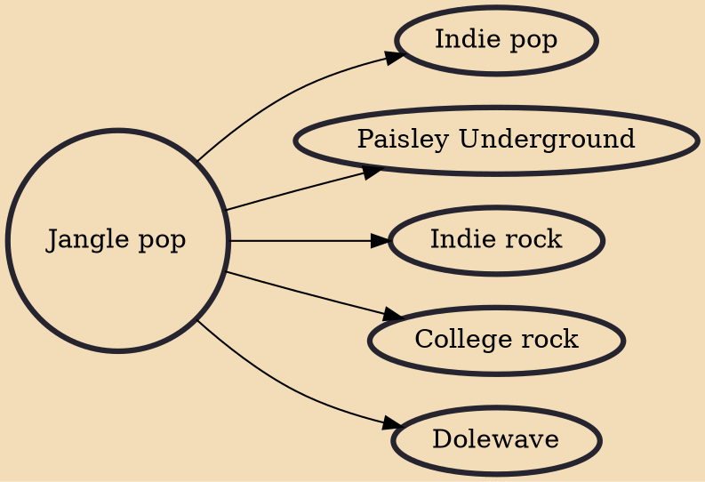

Jangle pop is a subgenre of pop rock or college rock that emphasizes jangly guitars and 1960s-style pop melodies. The term originated from Bob Dylan's song "Mr. Tambourine Man", whose 1965 rendition by the Byrds became considered one of the genre's representative works. Since the 1960s, jangle pop has crossed numerous genres, including power pop, psychedelia, new wave, post-punk, and lo-fi.

## Derivatives

- [[Indie pop]]
- [[Paisley Underground]]
- [[Indie rock]]
- [[College rock]]
- [[Dolewave]]
