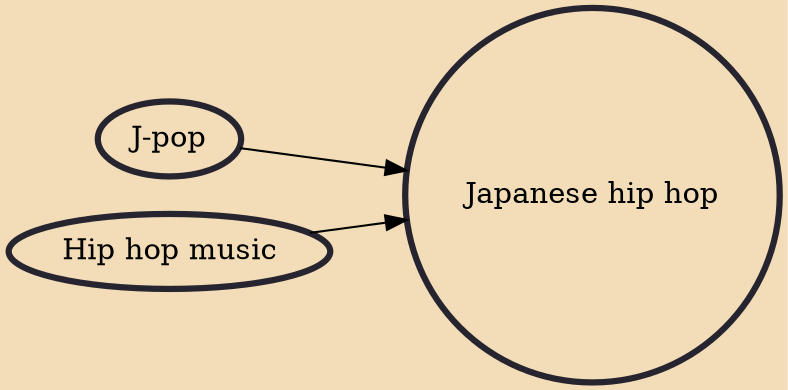

Japanese hip hop is hip hop music from Japan. It is said to have begun when Hiroshi Fujiwara returned to Japan and started playing hip hop records in the early 1980s. Japanese hip hop tends to be most directly influenced by old school hip hop, taking from the era's catchy beats, dance culture and overall fun and carefree nature and incorporating it into their music. As a result, hip hop stands as one of the most commercially viable mainstream music genres in Japan and the line between it and pop music is frequently blurred.

## Influences

- [[J-pop]]
- [[Hip hop music]]
