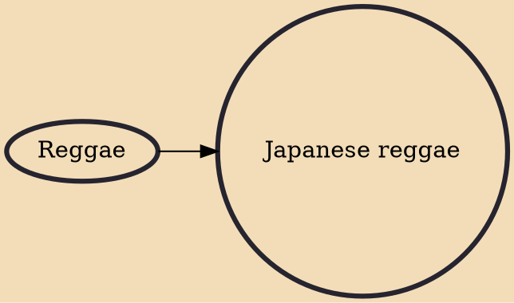

Japanese reggae is reggae music originating from Japan. The first reggae band to perform in Japan was The Pioneers who toured in 1975. However it was not until 1979, when Jamaican singer Bob Marley visited Japan on holiday that reggae would gain momentum. Marley wanted to attend a concert by the Flower Travellin Band and when looking for information, he met famed Japanese percussionist "Pecker" who informed him that the group had already disbanded. The two became good friends, and Pecker suggested to Marley a collaboration between acclaimed Japanese and Jamaican artists. This suggestion resulted in the albums Pecker Power, and Instant Rasta being recorded in Jamaica at "Channel One" and "Tuff Gong Studio" in 1980. The albums featured Japanese artists (吉田美奈子), Ryuuichi Sakamoto (坂本龍一), (松

## Influences
- [[Reggae]]
