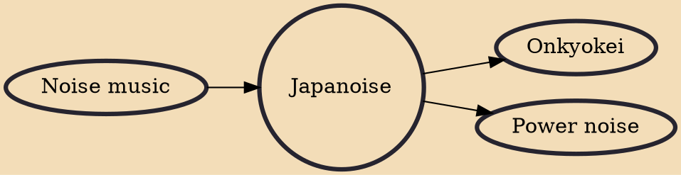

Japanoise (ジャパノイズ, Japanoizu), a portmanteau of "Japanese" and "noise", is the noise music scene of Japan. Nick Cain of The Wire identifies the "primacy of Japanese Noise artists like Merzbow, Hijokaidan and Incapacitants as one of the major developments in noise music since 1990. Certain Japanese noise artists themselves feel uncomfortable being categorized under the umbrella of "Japanese noise", arguing that use of the term is a way of ignoring the differences between musicians who don't necessarily follow the same approach or even know each other at all.

## Influences
- [[Noise music]]

## Derivatives
- [[Onkyokei]]
- [[Power noise]]
