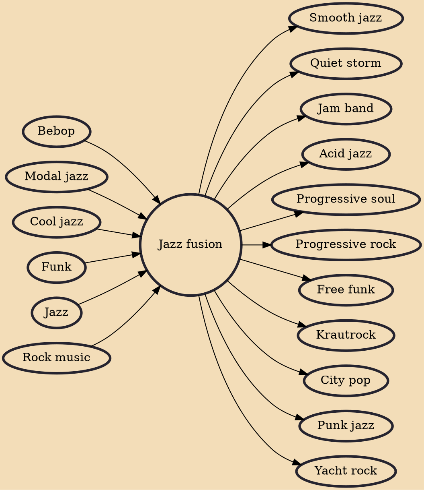

Jazz fusion (also known as fusion and progressive jazz) is a music genre that developed in the late 1960s when musicians combined jazz harmony and improvisation with rock music, funk, and rhythm and blues. Electric guitars, amplifiers, and keyboards that were popular in rock and roll started to be used by jazz musicians, particularly those who had grown up listening to rock and roll.

## Influences

- [[Bebop]]
- [[Modal jazz]]
- [[Cool jazz]]
- [[Funk]]
- [[Jazz]]
- [[Rock music]]

## Derivatives

- [[Smooth jazz]]
- [[Quiet storm]]
- [[Jam band]]
- [[Acid jazz]]
- [[Progressive soul]]
- [[Progressive rock]]
- [[Free funk]]
- [[Krautrock]]
- [[City pop]]
- [[Punk jazz]]
- [[Yacht rock]]
