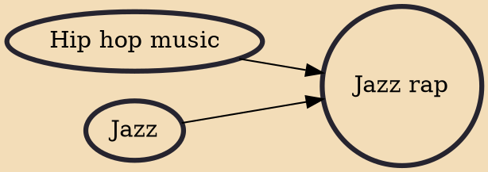

Jazz rap (or jazz hip hop) is a fusion of jazz and hip hop music, as well as an alternative hip hop subgenre, that developed in the late 1980s and early 1990s. AllMusic writes that the genre "was an attempt to fuse African-American music of the past with a newly dominant form of the present, paying tribute to and reinvigorating the former while expanding the horizons of the latter." The rhythm was rooted in hip hop over which were placed repetitive phrases of jazz instrumentation: trumpet, double bass, etc. Groups involved in the formation of jazz rap included A Tribe Called Quest, Digable Planets, De La Soul, Gang Starr, The Roots, Jungle Brothers, and Dream Warriors.

## Influences
- [[Hip hop music]]
- [[Jazz]]
