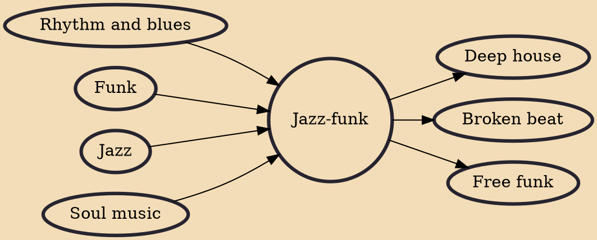

Jazz-funk is a subgenre of jazz music characterized by a strong back beat (groove), electrified sounds, and an early prevalence of analog synthesizers. The integration of funk, soul, and R&B music and styles into jazz resulted in the creation of a genre whose spectrum is quite wide and ranges from strong jazz improvisation to soul, funk or disco with jazz arrangements, jazz riffs, jazz solos, and sometimes soul vocals.

## Influences

- [[Rhythm and blues]]
- [[Funk]]
- [[Jazz]]
- [[Soul music]]

## Derivatives

- [[Deep house]]
- [[Broken beat]]
- [[Free funk]]
