```dot
digraph {
	graph [bgcolor="#F3DDB8" rankdir=LR]
	node [color="#26242F" penwidth=3.0]
	Jazz [shape=circle]
	Blues [URL="/blues/"]
	Blues -> Jazz
	"Folk music" [URL="/folk-music/"]
	"Folk music" -> Jazz
	Ragtime [URL="/ragtime/"]
	Ragtime -> Jazz
	Spirituals [URL="/spirituals/"]
	Spirituals -> Jazz
	"Spiritual jazz" [URL="/spiritual-jazz/"]
	Jazz -> "Spiritual jazz"
	"Hip hop tuga" [URL="/hip-hop-tuga/"]
	Jazz -> "Hip hop tuga"
	"Swing revival" [URL="/swing-revival/"]
	Jazz -> "Swing revival"
	Marabi [URL="/marabi/"]
	Jazz -> Marabi
	Kaseko [URL="/kaseko/"]
	Jazz -> Kaseko
	"Salsa music" [URL="/salsa-music/"]
	Jazz -> "Salsa music"
	"Orthodox pop music" [URL="/orthodox-pop-music/"]
	Jazz -> "Orthodox pop music"
	"Thai pop music" [URL="/thai-pop-music/"]
	Jazz -> "Thai pop music"
	"Post-progressive" [URL="/post-progressive/"]
	Jazz -> "Post-progressive"
	"Soul jazz" [URL="/soul-jazz/"]
	Jazz -> "Soul jazz"
	"Afro-soul" [URL="/afro-soul/"]
	Jazz -> "Afro-soul"
	"Hip hop music" [URL="/hip-hop-music/"]
	Jazz -> "Hip hop music"
	"Ryūkōka" [URL="/ryukoka/"]
	Jazz -> "Ryūkōka"
	"Traditional bluegrass" [URL="/traditional-bluegrass/"]
	Jazz -> "Traditional bluegrass"
	"Progressive rock" [URL="/progressive-rock/"]
	Jazz -> "Progressive rock"
	"Progressive rap" [URL="/progressive-rap/"]
	Jazz -> "Progressive rap"
	"Jam band" [URL="/jam-band/"]
	Jazz -> "Jam band"
	"Tejano music" [URL="/tejano-music/"]
	Jazz -> "Tejano music"
	"Free jazz" [URL="/free-jazz/"]
	Jazz -> "Free jazz"
	"Alternative hip hop" [URL="/alternative-hip-hop/"]
	Jazz -> "Alternative hip hop"
	"Dark cabaret" [URL="/dark-cabaret/"]
	Jazz -> "Dark cabaret"
	"East Coast hip hop" [URL="/east-coast-hip-hop/"]
	Jazz -> "East Coast hip hop"
	Ska [URL="/ska/"]
	Jazz -> Ska
	"Kayōkyoku" [URL="/kayokyoku/"]
	Jazz -> "Kayōkyoku"
	"Lofi hip hop" [URL="/lofi-hip-hop/"]
	Jazz -> "Lofi hip hop"
	"Reggae fusion" [URL="/reggae-fusion/"]
	Jazz -> "Reggae fusion"
	"Stride (music)" [URL="/stride-music/"]
	Jazz -> "Stride (music)"
	Amapiano [URL="/amapiano/"]
	Jazz -> Amapiano
	Skiffle [URL="/skiffle/"]
	Jazz -> Skiffle
	"Gothic country" [URL="/gothic-country/"]
	Jazz -> "Gothic country"
	"Uruguayan rock" [URL="/uruguayan-rock/"]
	Jazz -> "Uruguayan rock"
	"New flamenco" [URL="/new-flamenco/"]
	Jazz -> "New flamenco"
	"Bluegrass music" [URL="/bluegrass-music/"]
	Jazz -> "Bluegrass music"
	"No wave" [URL="/no-wave/"]
	Jazz -> "No wave"
	"Psychedelic rock" [URL="/psychedelic-rock/"]
	Jazz -> "Psychedelic rock"
	"K-pop" [URL="/k-pop/"]
	Jazz -> "K-pop"
	"Bossa nova" [URL="/bossa-nova/"]
	Jazz -> "Bossa nova"
	"Electro swing" [URL="/electro-swing/"]
	Jazz -> "Electro swing"
	"Plugg (music)" [URL="/plugg-music/"]
	Jazz -> "Plugg (music)"
	Afrobeat [URL="/afrobeat/"]
	Jazz -> Afrobeat
	"Samba rock" [URL="/samba-rock/"]
	Jazz -> "Samba rock"
	"Afro-Cuban jazz" [URL="/afro-cuban-jazz/"]
	Jazz -> "Afro-Cuban jazz"
	"Shibuya-kei" [URL="/shibuya-kei/"]
	Jazz -> "Shibuya-kei"
	"Lounge music" [URL="/lounge-music/"]
	Jazz -> "Lounge music"
	"Texas blues" [URL="/texas-blues/"]
	Jazz -> "Texas blues"
	"Leeds hip hop" [URL="/leeds-hip-hop/"]
	Jazz -> "Leeds hip hop"
	"Punk jazz" [URL="/punk-jazz/"]
	Jazz -> "Punk jazz"
	"Manila sound" [URL="/manila-sound/"]
	Jazz -> "Manila sound"
	Exotica [URL="/exotica/"]
	Jazz -> Exotica
	"New Mexico music" [URL="/new-mexico-music/"]
	Jazz -> "New Mexico music"
	"Folk baroque" [URL="/folk-baroque/"]
	Jazz -> "Folk baroque"
	"Old-school hip hop" [URL="/old-school-hip-hop/"]
	Jazz -> "Old-school hip hop"
	"Folk jazz" [URL="/folk-jazz/"]
	Jazz -> "Folk jazz"
	"Hard bop" [URL="/hard-bop/"]
	Jazz -> "Hard bop"
	"Indo jazz" [URL="/indo-jazz/"]
	Jazz -> "Indo jazz"
	"Big band" [URL="/big-band/"]
	Jazz -> "Big band"
	"Australian hip hop" [URL="/australian-hip-hop/"]
	Jazz -> "Australian hip hop"
	"Gypsy jazz" [URL="/gypsy-jazz/"]
	Jazz -> "Gypsy jazz"
	"Urban Pasifika" [URL="/urban-pasifika/"]
	Jazz -> "Urban Pasifika"
	"Dixieland jazz" [URL="/dixieland-jazz/"]
	Jazz -> "Dixieland jazz"
	"Latin jazz" [URL="/latin-jazz/"]
	Jazz -> "Latin jazz"
	Funk [URL="/funk/"]
	Jazz -> Funk
	"Jazz fusion" [URL="/jazz-fusion/"]
	Jazz -> "Jazz fusion"
	"Third stream" [URL="/third-stream/"]
	Jazz -> "Third stream"
	"Chamber jazz" [URL="/chamber-jazz/"]
	Jazz -> "Chamber jazz"
	"Avant-garde jazz" [URL="/avant-garde-jazz/"]
	Jazz -> "Avant-garde jazz"
	"Rock music" [URL="/rock-music/"]
	Jazz -> "Rock music"
	"Mini-jazz" [URL="/mini-jazz/"]
	Jazz -> "Mini-jazz"
	"Rock and roll" [URL="/rock-and-roll/"]
	Jazz -> "Rock and roll"
	Reggae [URL="/reggae/"]
	Jazz -> Reggae
	"Jazz rap" [URL="/jazz-rap/"]
	Jazz -> "Jazz rap"
	"Go-go" [URL="/go-go/"]
	Jazz -> "Go-go"
	"Jazz-funk" [URL="/jazz-funk/"]
	Jazz -> "Jazz-funk"
	"Sophisti-pop" [URL="/sophisti-pop/"]
	Jazz -> "Sophisti-pop"
	"Música popular brasileira" [URL="/musica-popular-brasileira/"]
	Jazz -> "Música popular brasileira"
	"Samba-jazz" [URL="/samba-jazz/"]
	Jazz -> "Samba-jazz"
	"Post-bop" [URL="/post-bop/"]
	Jazz -> "Post-bop"
	"Canterbury scene" [URL="/canterbury-scene/"]
	Jazz -> "Canterbury scene"
	"Rhythm and blues" [URL="/rhythm-and-blues/"]
	Jazz -> "Rhythm and blues"
	"Mod revival" [URL="/mod-revival/"]
	Jazz -> "Mod revival"
	"Brit funk" [URL="/brit-funk/"]
	Jazz -> "Brit funk"
	"Cape jazz" [URL="/cape-jazz/"]
	Jazz -> "Cape jazz"
	"Yé-yé" [URL="/ye-ye/"]
	Jazz -> "Yé-yé"
}
```

Jazz is a music genre that originated in the African-American communities of New Orleans, Louisiana in the late 19th and early 20th centuries, with its roots in blues and ragtime. Since the 1920s Jazz Age, it has been recognized as a major form of musical expression in traditional and popular music. Jazz is characterized by swing and blue notes, complex chords, call and response vocals, polyrhythms and improvisation. Jazz has roots in European harmony and African rhythmic rituals.

## Influences

- [[Blues]]
- [[Folk music]]
- [[Ragtime]]
- [[Spirituals]]

## Derivatives

- [[Spiritual jazz]]
- [[Hip hop tuga]]
- [[Swing revival]]
- [[Marabi]]
- [[Kaseko]]
- [[Salsa music]]
- [[Orthodox pop music]]
- [[Thai pop music]]
- [[Post-progressive]]
- [[Soul jazz]]
- [[Afro-soul]]
- [[Hip hop music]]
- [[Ryūkōka]]
- [[Traditional bluegrass]]
- [[Progressive rock]]
- [[Progressive rap]]
- [[Jam band]]
- [[Tejano music]]
- [[Free jazz]]
- [[Alternative hip hop]]
- [[Dark cabaret]]
- [[East Coast hip hop]]
- [[Ska]]
- [[Kayōkyoku]]
- [[Lofi hip hop]]
- [[Reggae fusion]]
- [[Stride (music)]]
- [[Amapiano]]
- [[Skiffle]]
- [[Gothic country]]
- [[Uruguayan rock]]
- [[New flamenco]]
- [[Bluegrass music]]
- [[No wave]]
- [[Psychedelic rock]]
- [[K-pop]]
- [[Bossa nova]]
- [[Electro swing]]
- [[Plugg (music)]]
- [[Afrobeat]]
- [[Samba rock]]
- [[Afro-Cuban jazz]]
- [[Shibuya-kei]]
- [[Lounge music]]
- [[Texas blues]]
- [[Leeds hip hop]]
- [[Punk jazz]]
- [[Manila sound]]
- [[Exotica]]
- [[New Mexico music]]
- [[Folk baroque]]
- [[Old-school hip hop]]
- [[Folk jazz]]
- [[Hard bop]]
- [[Indo jazz]]
- [[Big band]]
- [[Australian hip hop]]
- [[Gypsy jazz]]
- [[Urban Pasifika]]
- [[Dixieland jazz]]
- [[Latin jazz]]
- [[Funk]]
- [[Jazz fusion]]
- [[Third stream]]
- [[Chamber jazz]]
- [[Avant-garde jazz]]
- [[Rock music]]
- [[Mini-jazz]]
- [[Rock and roll]]
- [[Reggae]]
- [[Jazz rap]]
- [[Go-go]]
- [[Jazz-funk]]
- [[Sophisti-pop]]
- [[Música popular brasileira]]
- [[Samba-jazz]]
- [[Post-bop]]
- [[Canterbury scene]]
- [[Rhythm and blues]]
- [[Mod revival]]
- [[Brit funk]]
- [[Cape jazz]]
- [[Yé-yé]]
