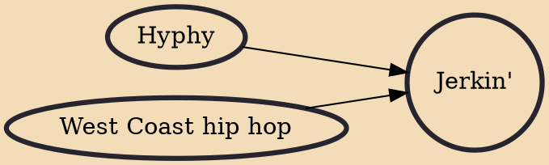

Jerkin' or Jerk is a street dance originating from and popularized by the Inland Empire-based groups New Boyz and Audio Push, and has origins in the Inland Empire and Los Angeles. Since 2009, jerkin' gained fans along the West Coast, East Coast, and in Europe, notably France and Germany, although it was heavily derided in the Southern United States.

## Influences

- [[Hyphy]]
- [[West Coast hip hop]]
