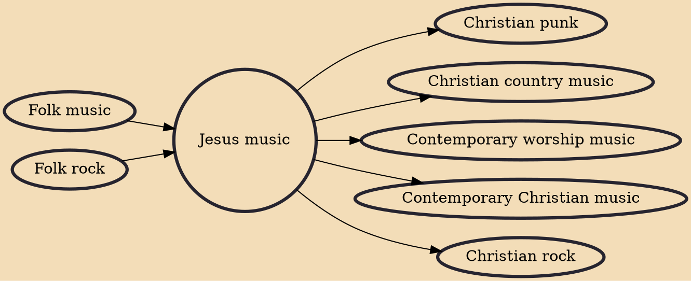

Jesus music, known as gospel beat music in the United Kingdom, is a style of Christian music that originated on the West Coast of the United States in the late 1960s and early 1970s. This musical genre developed in parallel to the Jesus movement. It outlasted the movement that spawned it and the Christian music industry began to eclipse it and absorb its musicians around 1975.

## Influences
- [[Folk music]]
- [[Folk rock]]

## Derivatives
- [[Christian punk]]
- [[Christian country music]]
- [[Contemporary worship music]]
- [[Contemporary Christian music]]
- [[Christian rock]]
