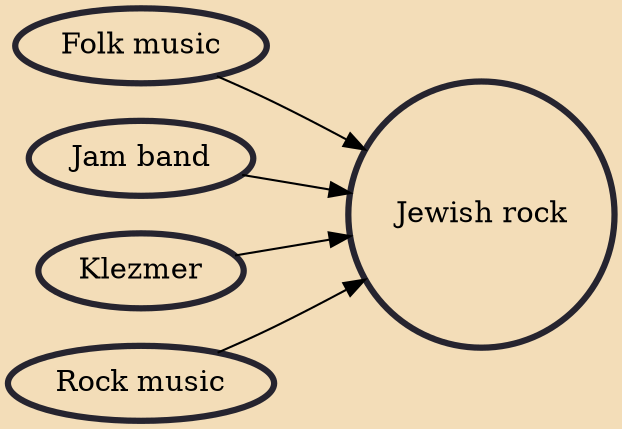

Jewish rock is a form of contemporary Jewish religious music that is influenced by various forms of secular rock music. Pioneered by contemporary folk artists like Rabbi Shlomo Carlebach and the Diaspora Yeshiva Band, the genre gained popularity in the 1990s and 2000s with bands like Soulfarm, Blue Fringe, and Moshav Band that appealed to teens and college students, while artists like Matisyahu enjoyed mainstream crossover success.

## Influences

- [[Folk music]]
- [[Jam band]]
- [[Klezmer]]
- [[Rock music]]
