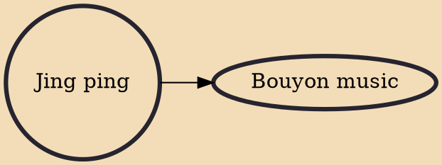

Jing Ping is a kind of folk music originated on the slave plantations of Dominica, also known colloquially as an accordion band. Dominican folk music, jing ping bands accompany a circle dance called the flirtation, as well as the Dominican quadrille.

## Derivatives

- [[Bouyon music]]
