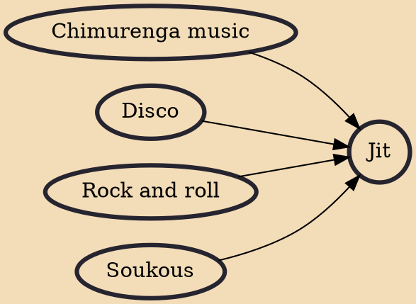

Jit (also known as jiti, jit-jive and the Harare beat) is a style of popular Zimbabwean dance music. It features a swift rhythm played on drums and accompanied by a guitar. Jit evolved out many diverse influences, including domestic chimurenga, Congolese rumba and Tanzanian guitar styles. The genre was popularized in the 1980s by bands like Chazezesa Challengers, The Four Brothers and Bhundu Boys. Jit is one of Zimbabwean fast beat, but there is a confusion between the more popular "sungura" which is said to be Jit which was popularised by Chazezesa Challengers and many others including Alick Macheso and Orchestra Mberikwazvo.

## Influences
- [[Chimurenga music]]
- [[Disco]]
- [[Rock and roll]]
- [[Soukous]]
