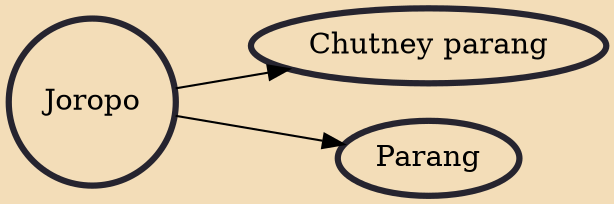

The joropo is a musical style resembling the fandango, and an accompanying dance. It originated in Venezuela and is also present in the eastern Colombian plains. It has African, Native South American, and European influences. There are different joropo variants: tuyero, oriental, and llanero. It is a fundamental genre of Venezuelan música criolla (creole music). It is also the most popular "folk rhythm": the well-known song "Alma Llanera" is a joropo, considered the unofficial national anthem of Venezuela.

## Derivatives

- [[Chutney parang]]
- [[Parang]]
