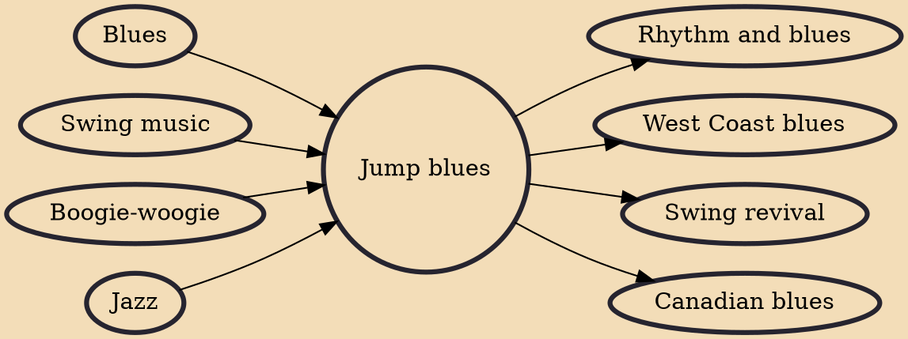

Jump blues is an up-tempo style of blues, usually played by small groups and featuring horn instruments. It was popular in the 1940s and was a precursor of rhythm and blues and rock and roll. Appreciation of jump blues was renewed in the 1990s as part of the swing revival.

## Influences

- [[Blues]]
- [[Swing music]]
- [[Boogie-woogie]]
- [[Jazz]]

## Derivatives

- [[Rhythm and blues]]
- [[West Coast blues]]
- [[Swing revival]]
- [[Canadian blues]]
