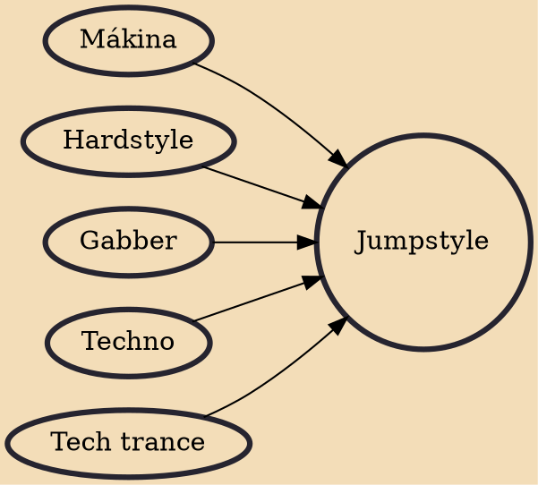

Jumpstyle is an electronic dance style and music genre popular in Western Europe, originally in Belgium. Jumpstyling is often referred to as "Jumpen": a combination of the English word 'Jump' and the Dutch and German suffix '-en' (meaning "to jump", or "jumping"). It originated in Belgium but gathered bigger popularity in their neighbouring country the Netherlands in the 2000s.

## Influences
- [[Mákina]]
- [[Hardstyle]]
- [[Gabber]]
- [[Techno]]
- [[Tech trance]]
