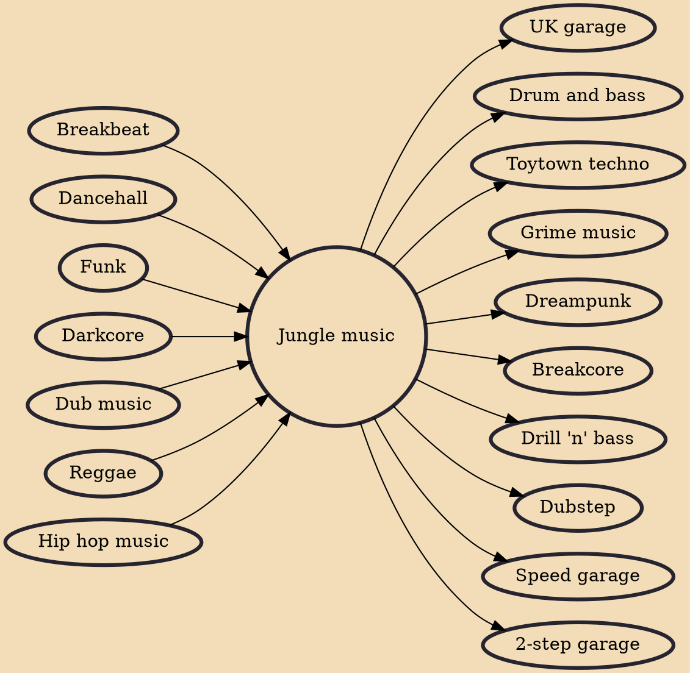

Jungle is a genre of dance music that developed out of the UK rave scene and sound system culture in the 1990s. Emerging from breakbeat hardcore, the style is characterised by rapid breakbeats, heavily syncopated percussive loops, samples, and synthesised effects, combined with the deep basslines, melodies, and vocal samples found in dub, reggae and dancehall, as well as hip hop and funk. Many producers frequently sampled the "Amen break" or other breakbeats from funk and jazz recordings. Jungle was a direct precursor to the drum and bass genre which emerged in the mid-1990s.

## Influences

- [[Breakbeat]]
- [[Dancehall]]
- [[Funk]]
- [[Darkcore]]
- [[Dub music]]
- [[Reggae]]
- [[Hip hop music]]

## Derivatives

- [[UK garage]]
- [[Drum and bass]]
- [[Toytown techno]]
- [[Grime music]]
- [[Dreampunk]]
- [[Breakcore]]
- [[Drill 'n' bass]]
- [[Dubstep]]
- [[Speed garage]]
- [[2-step garage]]
