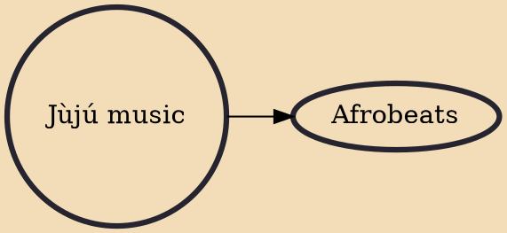

Jùjú is a style of Yoruba popular music, derived from traditional Yoruba percussion. The name juju from the Yoruba word "juju" or "jiju" meaning "throwing" or "something being thrown". Juju music did not derive its name from juju, which is a form of magic and the use of magic objects, common in West Africa, Haiti, Cuba and other South American nations. It evolved in the 1900s in urban clubs across the countries, and was believed to have been created by Ababababaa Babatunde King, popularly known as Tunde King. The first jùjú recordings were by King and in the 1920s, when King pioneered it. The lead and predominant instrument of jùjú is the Iya Ilu, talking drum.

## Derivatives
- [[Afrobeats]]
