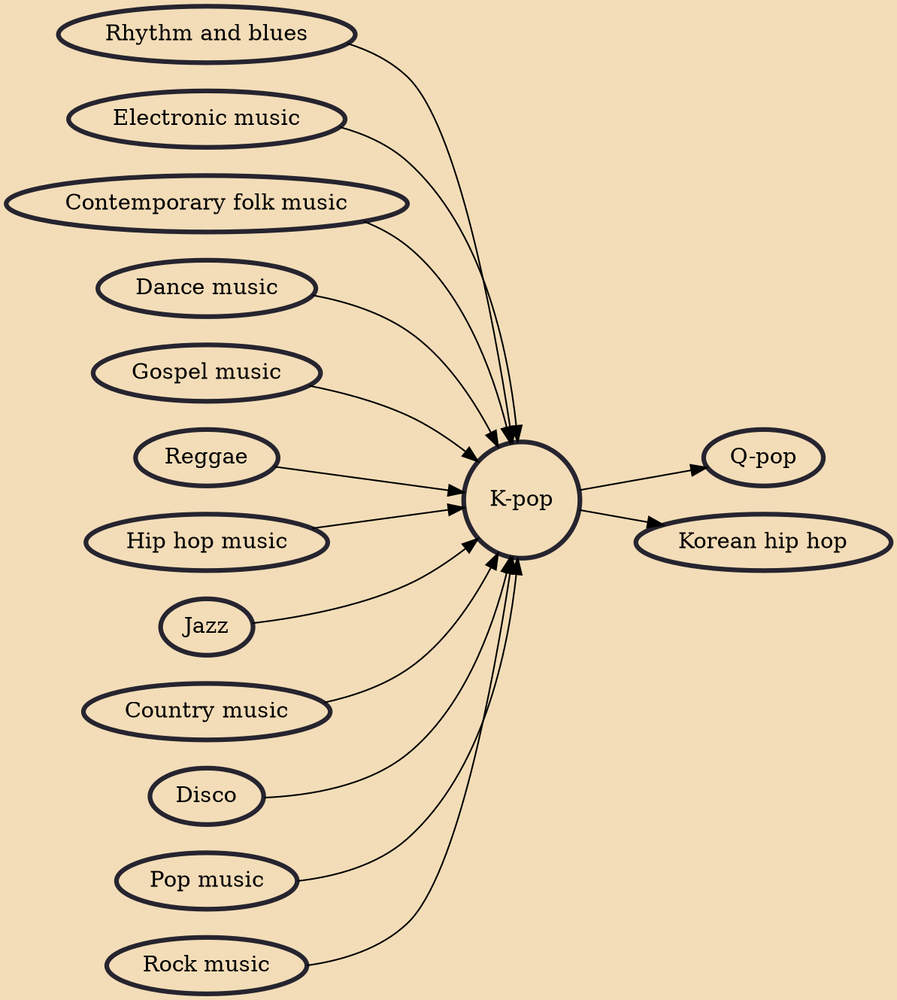

K-pop (Korean: 케이팝; RR: keipap), short for Korean popular music, is a form of popular music originating in South Korea as part of South Korean culture. It includes styles and genres from around the world, such as pop, hip hop, R&B, experimental, rock, jazz, gospel, reggae, electronic dance, folk, country, disco, and classical on top of its traditional Korean music roots. The term "K-pop" became popular in the 2000s, especially in the international context. The Korean term for domestic pop music is gayo (Korean: 가요; Hanja: 歌謠), which is still widely used within South Korea. While "K-pop" can refer to all popular music or pop music from South Korea, it is colloquially often used in a narrower sense for any Korean music and artists associated with the entertainment and idol industry in the c

## Influences

- [[Rhythm and blues]]
- [[Electronic music]]
- [[Contemporary folk music]]
- [[Dance music]]
- [[Gospel music]]
- [[Reggae]]
- [[Hip hop music]]
- [[Jazz]]
- [[Country music]]
- [[Disco]]
- [[Pop music]]
- [[Rock music]]

## Derivatives

- [[Q-pop]]
- [[Korean hip hop]]
