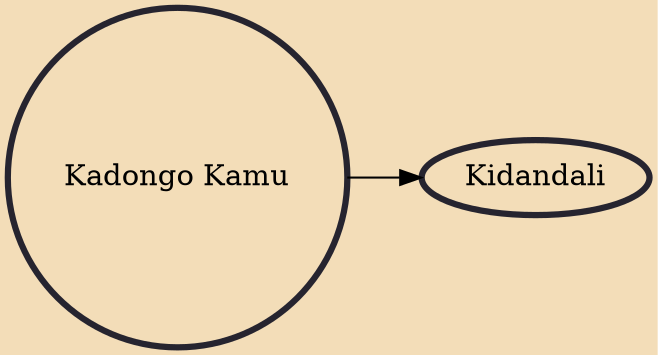

Kadongo Kamu is a music genre native to Uganda and is the oldest mainstream music genre in the country. The word "kadongo kamu" is a term in the Ganda language that means "one little guitar". To understand why the genre has this name, one has to understand the stylistic structure of the music which is created with only one acoustic guitar, a . But this is not always the case and many times other instruments are involved. However the true style of the music relies only on one acoustic guitar as instrumentation, hence the "one little guitar" name.

## Derivatives
- [[Kidandali]]
